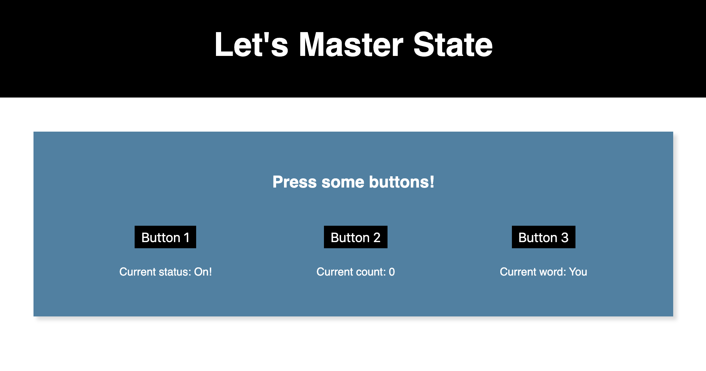

# Three Button State Lab

This template is designed to demonstrate a few basic implementations of the useState hook.

## Getting Started

1. Clone this repository using `git clone`
2. `cd` into the project folder
3. `npm install`
4. `npm start`
